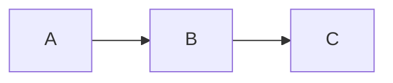

# Presentation with Slidev

Author and iterate on presentations in Slidev. Source is markdown; final delivery is PDF rendered via the Slidev CLI.

This skill assumes the Slidev CLI is installed on the system. Setup instructions are managed separately.

## When to Use

- Thesis defense / academic talks (LaTeX equations, references, figures)
- Side project / technical talks (code demos, architecture diagrams)
- Any presentation that ends as a PDF (or web-hosted slides)

Not a fit for pixel-perfect corporate/marketing decks — use python-pptx with a designed template for those.

## Authoring Workflow

1. **Scope first** — Confirm with the user before writing slides:
   - Audience and tone (academic / dev community / internal)
   - Approximate slide count
   - Theme preference (see below)
   - Required content sections (problem, method, results, demo, etc.)

2. **Scaffold a project** — If a Slidev project does not exist yet:
   ```sh
   npm init slidev@latest <project-name>
   ```
   Then edit `slides.md` as the source of truth.

3. **Edit the markdown source** — One file (`slides.md`) holds all slides. Use Slidev syntax (see below).

4. **Render to PDF** — From the project directory:
   ```sh
   slidev export --output slides.pdf
   ```

5. **Verify with Read tool** — Read the rendered PDF to inspect layout, overflow, alignment, and content. Note any issues that the markdown source does not reveal.

6. **Iterate** — Apply user feedback to the markdown source, re-render, re-verify. Do not claim a slide is done until the rendered PDF has been visually checked.

## Theme Selection

| Theme | Best for | Notes |
|-------|----------|-------|
| `seriph` | 학위논문 발표, 학술 발표 | Serif, editorial, formal |
| `apple-basic` | 사이드 프로젝트, 기술 발표 | Keynote-like, clean |
| `default` | 미니멀 발표 | Sans-serif, neutral |
| `bricks` | 캐주얼/창의적 발표 | Bold, playful |

Set in frontmatter:
```yaml
---
theme: seriph
---
```

Community themes installable via `npm i slidev-theme-<name>`.

## Slidev Syntax Essentials

### Slide separation
```markdown
# First slide

---

# Second slide
```

### Per-slide frontmatter
```markdown
---
layout: cover
background: https://source.unsplash.com/abstract
class: text-white
---

# Title Slide
```

### Useful layouts
- `cover` — title slide
- `default` — standard content
- `two-cols` — 2-column (use `::right::` to split)
- `image-right` / `image-left` — image + text
- `center` — centered content
- `section` — section divider
- `statement` — single emphasized statement
- `quote` — quotation slide

### Click animations
```markdown
<v-click>이 줄은 클릭 시 등장</v-click>

<v-clicks>

- 첫 클릭에 등장
- 두 번째 클릭에 등장

</v-clicks>
```

### Code blocks with line highlighting
````markdown
```ts {1|3-5|all}
const x = 1;
function fn() {
  return x + 1;
}
```
````

### Magic Move (코드 줄 단위 morph 애니메이션)
````markdown
````md magic-move
```ts
const x = 1
```
```ts
const x = 1
const y = 2
```
````
````

### LaTeX 수식
```markdown
인라인: $E = mc^2$

블록:
$$
\frac{\partial L}{\partial \theta} = 0
$$
```

### Mermaid 다이어그램
````markdown

````

### 2단 레이아웃
```markdown
---
layout: two-cols
---

# 왼쪽 내용

::right::

# 오른쪽 내용
```

### 스피커 노트
```markdown
# 슬라이드 제목

내용

<!--
발표자 노트는 PDF에 안 나오지만 -dev 모드에서 보임
-->
```

## Render & Verify Loop

1. Edit `slides.md`
2. `slidev export --output slides.pdf`
3. Read `slides.pdf` with the Read tool (PDF native support, up to 20 pages per call — use `pages` arg for longer decks)
4. Identify problems: overflow, alignment, contrast, missing content
5. Fix in markdown, repeat

For long decks, render and review in chunks (e.g., pages 1-15, 16-30) to stay within Read tool limits.

## Output Locations

- Source: `slides.md` (in project root)
- Rendered PDF for verification and final delivery: `slides.pdf`
- Optional .pptx export (image-based, no editable content): `slidev export --format pptx`

## Verification Checklist

Before declaring a presentation done:

- [ ] All slides rendered without overflow or cut text
- [ ] Code blocks render with intended highlights
- [ ] Equations / diagrams render correctly
- [ ] Theme and color contrast appropriate for the venue
- [ ] Slide count matches the agreed scope
- [ ] User has reviewed the rendered PDF, not just the markdown

## Limitations to Surface

- Layout is markdown/CSS-driven. Pixel-precise alignment requires Vue components or custom CSS.
- Default themes have a "developer-clean" look. Heavy brand/marketing decks need custom theme work.
- `.pptx` export is image-based — slides are not editable in PowerPoint after export.
